<!-- ========================================== -->
<!-- HERO: TERMINAL WORDMARK & NEOFETCH CARD    -->
<!-- ========================================== -->

<h3><code>pranjal@inferics ~ $ whoami</code></h3>

<table>
  <tr>
    <td valign="top"></td>
    <td valign="top"></td>
  </tr>
</table>

 
 

<!-- ========================================== -->
<!-- ANIMATED 53-WEEK CONTRIBUTION HEATMAP      -->
<!-- Regenerated daily by GitHub Actions cron    -->
<!-- ========================================== -->

<h3><code>pranjal@inferics ~ $ ./contributions.sh</code></h3>

 
 

<!-- ========================================== -->
<!-- CONNECT & LINKS                            -->
<!-- ========================================== -->

<h3><code>pranjal@inferics ~ $ ./links.sh</code></h3>

<b>IoT &amp; Computer Vision Researcher · Robotics Engineer · Systems Builder</b>

 

