<!-- ======================================================== -->
<!-- UNIFIED DUAL-PANE TERMINAL HERO (ASCII PFP + NEOFETCH)   -->
<!-- ======================================================== -->

 
 

<!-- ======================================================== -->
<!-- ALL-GREEN ANIMATED CONTRIBUTION HEATMAP (53 WEEKS)       -->
<!-- ======================================================== -->

 
 

<!-- ======================================================== -->
<!-- INTERACTIVE DAILY ACTIVITY LOG (DATES & COUNTS)          -->
<!-- ======================================================== -->

<b>📅 View Complete Daily Activity Log (Exact Dates &amp; Commit Counts)</b>

 

> **Total Recorded Contributions:** 3,251 &nbsp;|&nbsp; **Active Streak:** 366 Days &nbsp;|&nbsp; **Status:** Continuous Deployment

| Date | Day | Daily Contributions | Intensity |
| :--- | :--- | :---: | :--- |
| `2026-09-21` | Monday | **5 contributions** | 🟩🟩 (Level 2) |
| `2026-09-20` | Sunday | **12 contributions** | 🟩🟩🟩 (Level 3) |
| `2026-09-19` | Saturday | **5 contributions** | 🟩🟩 (Level 2) |
| `2026-09-18` | Friday | **10 contributions** | 🟩🟩🟩 (Level 3) |
| `2026-09-17` | Thursday | **8 contributions** | 🟩🟩🟩 (Level 3) |
| `2026-09-16` | Wednesday | **2 contributions** | 🟩 (Level 1) |
| `2026-09-15` | Tuesday | **4 contributions** | 🟩🟩 (Level 2) |
| `2026-09-14` | Monday | **6 contributions** | 🟩🟩 (Level 2) |
| `2026-09-13` | Sunday | **10 contributions** | 🟩🟩🟩 (Level 3) |
| `2026-09-12` | Saturday | **2 contributions** | 🟩 (Level 1) |
| `2026-09-11` | Friday | **3 contributions** | 🟩 (Level 1) |
| `2026-09-10` | Thursday | **8 contributions** | 🟩🟩 (Level 2) |
| `2026-09-09` | Wednesday | **8 contributions** | 🟩🟩🟩 (Level 3) |
| `2026-09-08` | Tuesday | **7 contributions** | 🟩🟩 (Level 2) |
| `2026-09-07` | Monday | **7 contributions** | 🟩🟩 (Level 2) |
| `2026-09-06` | Sunday | **22 contributions** | 🟩🟩🟩🟩🟩 (Level 5) |
| `2026-09-05` | Saturday | **19 contributions** | 🟩🟩🟩🟩 (Level 4) |
| `2026-09-04` | Friday | **5 contributions** | 🟩🟩 (Level 2) |
| `2026-09-03` | Thursday | **14 contributions** | 🟩🟩🟩🟩 (Level 4) |
| `2026-09-02` | Wednesday | **2 contributions** | 🟩 (Level 1) |
| `2026-09-01` | Tuesday | **4 contributions** | 🟩 (Level 1) |
| `2026-08-31` | Monday | **3 contributions** | 🟩 (Level 1) |
| `2026-08-30` | Sunday | **5 contributions** | 🟩🟩 (Level 2) |
| `2026-08-29` | Saturday | **2 contributions** | 🟩 (Level 1) |
| `2026-08-28` | Friday | **6 contributions** | 🟩🟩 (Level 2) |
| `2026-08-27` | Thursday | **18 contributions** | 🟩🟩🟩🟩 (Level 4) |
| `2026-08-26` | Wednesday | **8 contributions** | 🟩🟩 (Level 2) |
| `2026-08-25` | Tuesday | **2 contributions** | 🟩 (Level 1) |
| `2026-08-24` | Monday | **9 contributions** | 🟩🟩🟩 (Level 3) |
| `2026-08-23` | Sunday | **3 contributions** | 🟩 (Level 1) |
| `2026-08-22` | Saturday | **9 contributions** | 🟩🟩🟩 (Level 3) |
| `2026-08-21` | Friday | **3 contributions** | 🟩 (Level 1) |
| `2026-08-20` | Thursday | **13 contributions** | 🟩🟩🟩 (Level 3) |
| `2026-08-19` | Wednesday | **16 contributions** | 🟩🟩🟩🟩 (Level 4) |
| `2026-08-18` | Tuesday | **4 contributions** | 🟩🟩 (Level 2) |

 

<i>Showing recent 35-day active cycle. Auto-refreshed daily by GitHub Actions cron.</i>

 

<!-- ======================================================== -->
<!-- LABS, HONORS & VERIFIED IDENTITIES                       -->
<!-- ======================================================== -->

<b>IoT &amp; Computer Vision Researcher · Robotics Engineer · Systems Builder</b>

 

